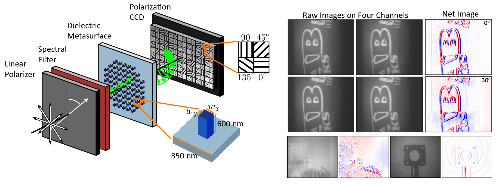

# Polarization Multi-Image Synthesis with Birefringent Metasurfaces
## [ [Paper and Supplement] ](Documents/Polarization_Multi_Image_Synthesis_with_Birefringent_Metasurfaces.pdf)
This paper was published in the proceedings of the 2023 IEEE International Conference on Computational Photography (ICCP). 

Along with this repository which contains the code to reproduce the results in the main paper, we also release a seperate package, called  <a href="https://github.com/DeanHazineh/DFlat" target="_blank">D-Flat </a>, which provides a comprehensive auto-differentiable framework for end-to-end design of diffractive optical elements.  

If you would like to reference either work or if you make use of the code/dataset, please cite it using the format shown at the bottom: 

## Summary:
<div align="center">
  
</div>


## Install and Run


## Credits and Acknowledgements:
```
@INPROCEEDINGS{Hazineh2023,
  Author = {Dean Hazineh and Soon Wei Daniel Lim and Qi Guo and Federico Capasso and Todd Zickler},
  booktitle = {2023 IEEE International Conference on Computational Photography (ICCP)}, 
  Title = {Polarization Multi-Image Synthesis with Birefringent Metasurfaces},
  Year = {2023},
}
```
